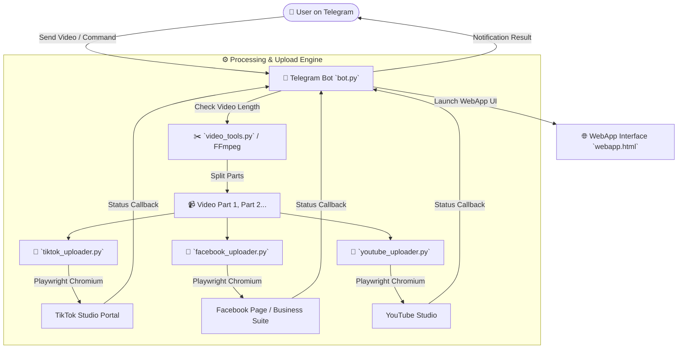

<div align="center">

# 🚀 Social Auto Poster & Telegram Bot

[](https://www.python.org/)
[](https://playwright.dev/python/)
[](https://core.telegram.org/bots/api)
[](LICENSE)

**An end-to-end multi-platform video automation system controlled via Telegram Bot & WebApp.**  
Automatically split long videos, upload to **TikTok Studio**, **Facebook Reels/Page**, and **YouTube Studio**, apply custom captions, hashtags, and dynamic cover thumbnails without API limitations.

[Features](#-key-features) • [Architecture](#-architecture) • [Installation](#-installation--setup) • [Usage](#-usage-guide) • [License](#-license)

---

</div>

## 🌟 Key Features

- 📱 **Telegram Bot Interface & WebApp UI**: Fully managed directly from your phone or desktop via Telegram inline keyboards and web app interface.
- ✂️ **Automatic Video Splitting**: Automatically splits long videos into $N$ parts using `ffmpeg` without re-encoding to preserve maximum video quality.
- 🎵 **TikTok Studio Automation**:
  - Auto video upload & editor transition detection.
  - Smart caption insertion with hashtag auto-formatting.
  - Dynamic **Edit Cover / Thumbnail** selector & file upload.
  - Automatic focus stealing & pop-up dismissal (e.g. Chrome crash popups, TikTok policy dialogs).
- 📘 **Facebook Video & Reels Upload**:
  - Handles Facebook Page Creator Studio / Business Suite workflows.
  - Custom title, description, and page-level video options.
- 🔴 **YouTube Studio Automation**:
  - Automated video publishing pipeline with playlist and thumbnail support.
- 🔒 **Persistent Session Profiles**: Stores cookies and local browser states (`*_profile/`) locally so login is only required once.
- 🌐 **Tunneling Integration**: Built-in support for WebApp local tunneling (LocalTunnel / Serveo / Pinggy).

---

## 🏗️ Architecture



---

## 📦 Installation & Setup

### 1. Prerequisites
- **Python 3.10+**
- **FFmpeg** installed and added to system `PATH`
- **Git**

### 2. Clone & Install Dependencies
```bash
git clone https://github.com/phuclekl7-droid/upload-video.git
cd upload-video

# Install Python packages
pip install -r requirements.txt

# Install Playwright browser drivers
playwright install chromium
```

### 3. One-Time Account Login Setup
Run the login helpers once to log into your social media accounts and save browser states:

```bash
# Log in to TikTok
python login_tiktok.py

# Log in to Facebook
python login_facebook.py

# Log in to YouTube
python login_youtube.py
```
*Note: A browser window will open. Complete the login process manually once. Session data will be safely cached in `tiktok_profile/`, `facebook_profile/`, and `youtube_profile/`.*

---

## 🚀 Usage Guide

### Starting the Telegram Bot
```bash
python bot.py
```

### Available Telegram Commands
- `/start` - Launch the main menu and WebApp.
- `/post` - Initiate video upload wizard.
- `/split` - Split a video into custom equal parts before publishing.
- `/status` - Check current active upload tasks and server status.

---

## 🛠️ Project Structure

```dir
.
├── bot.py                # Main Telegram Bot runner & task queue
├── tiktok_uploader.py    # Playwright automation script for TikTok Studio
├── facebook_uploader.py  # Playwright automation script for Facebook
├── youtube_uploader.py   # Playwright automation script for YouTube Studio
├── video_tools.py        # FFmpeg video splitting and metadata processing
├── webapp.html           # Telegram WebApp front-end interface
├── login_tiktok.py       # Helper script to initialize TikTok browser session
├── login_facebook.py     # Helper script to initialize Facebook browser session
├── login_youtube.py      # Helper script to initialize YouTube browser session
├── requirements.txt      # Python dependencies list
└── .gitignore            # Git ignore rules for session data & temp files
```

---

## 📝 License

Distributed under the MIT License. See `LICENSE` for more information.

---

<div align="center">
  <sub>Built with ❤️ using Python, Playwright & Telegram Bot API</sub>
</div>
