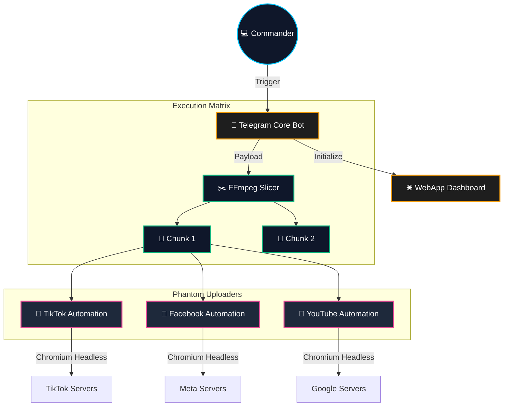

<div align="center">


[](https://github.com)
[](https://python.org)
[](https://playwright.dev/)
[](https://core.telegram.org/)

**An end-to-end cybernetic automation system controlled via Telegram WebApp.**  
*Bypass API limitations. Simulate human intelligence. Distribute video assets globally.*

[Features](#-core-capabilities) • [Architecture](#-system-architecture) • [Setup](#-deployment) • [Usage](#-mission-control)

---
</div>

## 🌌 Core Capabilities

### ⚡ Neural Video Processing
- **Quantum Splitter**: Utilizes `ffmpeg` to parse and slice massive video files into optimal segments in milliseconds, without quality degradation (zero re-encoding).

### 🛡️ Phantom Automation (Playwright)
- **TikTok Studio Integration**: Dynamic DOM traversal to bypass popups, inject metadata (captions & hashtags), and auto-upload custom thumbnails.
- **Meta (Facebook) Network**: Seamless interaction with Facebook Creator Studio/Business Suite.
- **YouTube Mainframe**: Automated sequence execution for YouTube Studio.

### 🎛️ Command Center
- **Telegram WebApp UI**: A futuristic, responsive dashboard built directly into your Telegram client. Control uploads, track statuses, and split videos on the fly.
- **State Persistence**: Securely caches session cookies (`*_profile/`) to maintain permanent authentication tunnels.

---

## 🧬 System Architecture



---

## 💻 Deployment

```bash
# 1. Clone the repository into your local mainframe
git clone https://github.com/phuclekl7-droid/upload-video.git
cd upload-video

# 2. Install dependencies & initialize phantom browser drivers
pip install -r requirements.txt
playwright install chromium

# 3. Authenticate communication protocols (Run once)
python login_tiktok.py
python login_facebook.py
python login_youtube.py
```

## 🛰️ Mission Control

Ignite the primary bot process:
```bash
python bot.py
```

**Commands:**
- `/start` - Access the WebApp Matrix.
- `/split` - Activate the video slicer module.
- `/status` - Diagnostics and current operations.

---
<div align="center">
  
</div>
